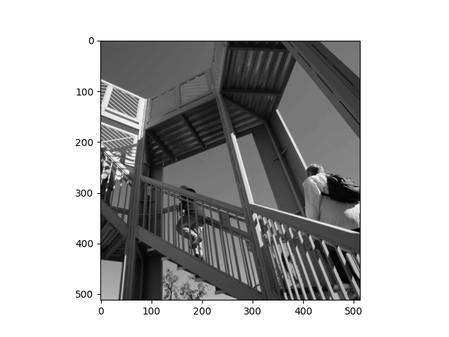
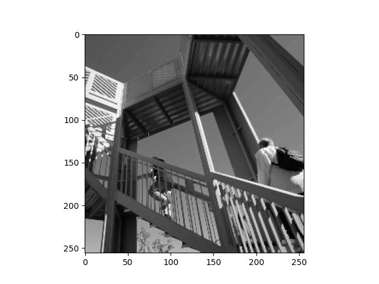
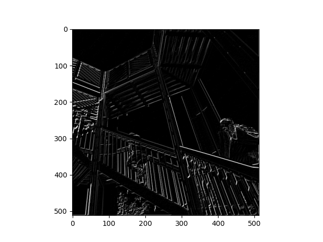
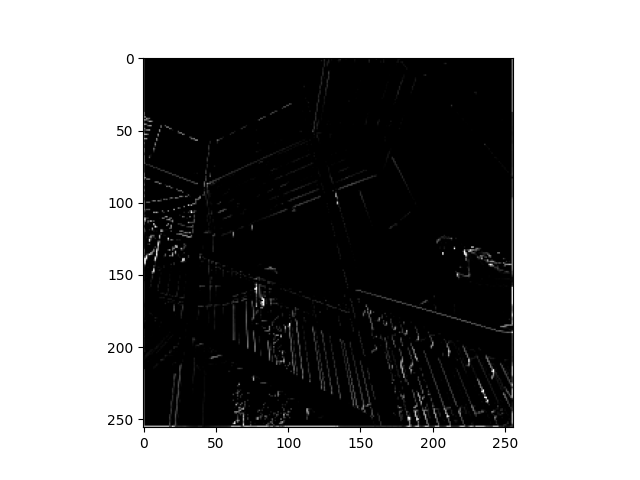

#Part 1

##Plots:
How did each filter transformed each image.

Original picture

filter:[ [ -1, 0, 1], [1, -1, 0],  [0, 0. 0 ]]

got bridgter

CHANGE MORE FILTERS

got darker
filter = [ [1, 1, 0], [-2, 1, -2], [1, 0, -1]]

2x2

Complexity decreases 

#Part 2

What are you functionally accomplishing as you apply the filter to your original array? 

•

Why is the application of a convolving filter to an image useful for computer vision? 

•

In effect what have you accomplished by applying this filter? 

•

Does there seem to be a logic (i.e. maximizing, averaging or minimizing values?) associated with the pooling filter provided in the example exercise (convolutions & pooling)? 

•

Did the resulting image increase in size or decrease? 

•

Why would this method be useful? 

•