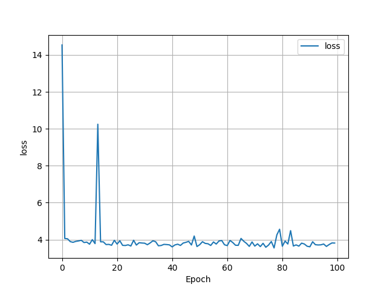
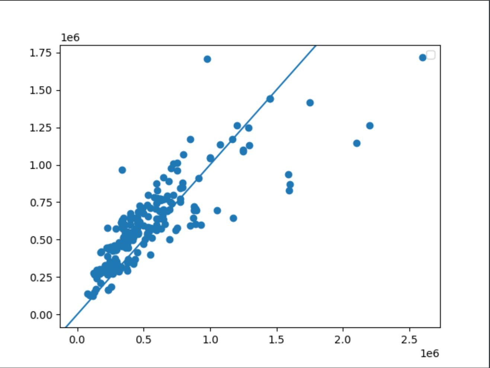

I scrapped 417 homes from Zillow's database from the city of Williamsburg. After removing listings that had unavailable data, I had a total of 217 homes remaining. 

1) How did your model fare?
The model specified used three independent variables: number of bedrooms, number of bathrooms, and living Area, to predict home value. After initial difficulty with scaling and rescaling data, I received an output. The model had a mean squared error of 3.79 (with scaled data) and a correlation coefficient of 0.848.

The model loss function is shown in the following:

Though we see some oscillation, the loss function evens out after about 20 epochs.

The actual price (x-axis) vs the predicted price yielded positive results:

From our loss function, correlation coefficient, and predicted vs actual plot, there is evidence that our model fares well against the data. 

2) In your estimation is there a particular variable that may improve model performance?

I believe there could be several factors that contribute to the home values; the proximity to Colonial Williamburg could increase home value, historical homes would fetch higher prices, and houses located in country clubs would increase their value.

3) Which of the predictions were the most accurate? In which percentile do these most accurate predictions reside? 
   
Visually, the model was better at predicting home values that were less expensive; it looks like the graph shows a heteroskedastic pattern, where early datapoints more or less adhere to the line, whereas the model predicted higher-priced home values less accurately.

Running additional code, the five most accurate predictions:

1) index = 34  
   difference(predicted vs actual) =-0.0275 
   listing values = 400,000
   
2) index = 1   
   difference(predicted vs actual) =-0.0269 
   listing values = 339,900
   
3) index = 74  
   difference(predicted vs actual) =-0.0230 
   
   listing values = 239,900
   
4) index = 358 
   
   difference(predicted vs actual) = 0.0378 
   
   listing values = 339,645
   
5) index = 241 
   
   difference(predicted vs actual) = 0.0441 
   
   listing values = 535,900

The best and second-best predicted value ($239,900, $339,900) is below the 25th percentile, $399,220 and $617,500 were the 50th and 75th percentiles, respectively. The five most accurate predictions ranged from below the 25th percentile to above the 50th percentile; lower-priced listings were better predicted.

4) Did your model trend towards over or under predicting home values?
   
From identifying the graph, the model tends to overpredict home values. When doing a comparison between the predicted home values and actual home values, the result 0.26 at the 50th percentile. Due to this positive non-zero value, the model overpredicted.

5) Which feature appears to be the most significant predictor? 
   
Living area appears to be the most significant predictor; when I removed the livingArea variable from our dataframe, the MSE increased the most as compared to our other variables: number of bedrooms and number of bathrooms. The large change in MSE suggests that livingArea affects the model the most.