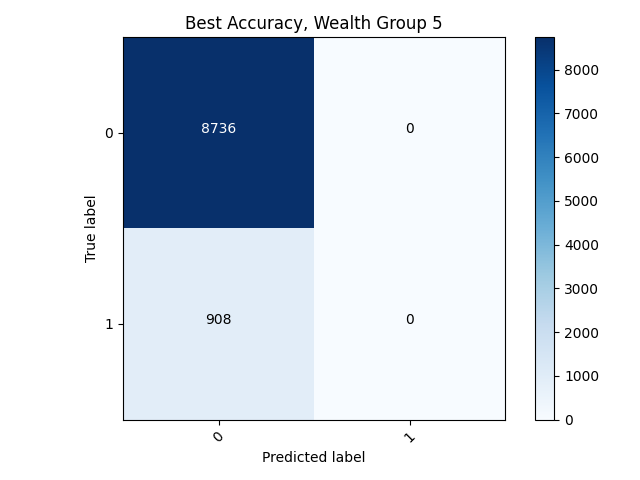

# Project 3

## Binary Target Model

### Best (Highest Accuracy)

• Wealth Group 5, the highest wealth group, had the best binary model, with a final accuracy of a whopping 96.2%. Due to the close proximity between the test accuracy and training accuracy, I didn't see any problems with overfitting. I continued using the same features, ultimately dropping `['hhid','pnmbr','weights', 'unit']` from the data and changing gender into a categorical variable. 

### Confusion Matrix 

### Worst (Lowest Accuracy)

• Wealth Group 2 had the lowest accuracy among the five wealth classes, reaching an accuracy of about 0.74. Additionally, there were no issues with the model being overfit as the testing accuracy also remained at about 0.74. From this information alone, our overall modeling technique seems decent in predicting the accurate result, but our confusion matrices prove otherwise.

### Confusion Matrix and Analysis

• when looking at the confusion matrix, there is an unusual trend; the model is only predicting 0, suggesting that the model will only ever predict 0 even after the feature values are changed. Thus, Wealth Class 2 performs poorly and is considered the most inaccurate because it has the highest sample size. Moreover, it has the worst accuracy because there are more data points that are not 0. 

• even though the accuracy for the model (especially Wealth Class 5), is decent, our analysis of the confusion matrix draws another conclusion: the binary model is not an accurate measurement.

## Categorical Target model

•At first, I was unsure how to manipulate the Binary Model code to handle the categorical data. After a brief demonstration in classs, I changed the Dense Layer to 6 and used SparseCategoricalCrossentropy and SparseCategoricalAccuracy to have the code run without additional errors.

•The Categorical Target model did not perform well, with a test accuracy of 0.588.  

• After looking at the confusion matrix and comparing it to our binary model, the categorical target model actually **did** fare better than the previous model, contrary to our resulted accuracies; this is because our model was actually classifying the data, not just consistently labeling the data points as 0. Additionally, at each wealth class level, even if there was misclassification, the predicted value was not too far off from the actual value.

### Aggregation of Binary Model 

• after aggregation using our binary model, we received a positive outcome; the model was **finally** able to correctly predict some of the values as opposed to simply stating that all the values were 0.

### Attempting Improvements (Binary) w/ Aggregation

**At Epoch 10:** 

**At Epoch 10:** 

• To switch up the data a bit in attempts to improve the model, I changed the toilet feature into three separate columns as follows:

1) cols1 = `['Flush to pit latrine', 'Flush to piped sewer system','Flush to somewhere else','Flush to septic tank', "Flush, don't know where"]`

2) cols2= `['Ventilated Improved Pit latrine (VIP)', 'Pit latrine without slab/open pit', 'Pit latrine with slab']`

3) cols3 = `['No facility/bush/field','99','Hanging toilet/latrine', 'Composting toilet','Bucket toilet','Other', ]`

• However, there was very little change in the results; both accuracies decreased slighly and loss increased slightly.

### Attempting improvements (Categorical) w/ Aggregation

**At Epoch 10:** 

• Similarly to the Binary Model, I changed the toilet feature into three separate columns, but the accuracy decreased from 0.58 to 0.54, a noticeable difference. Additionally, even looking at the confusion matrix we can tell that the model is less accurate; it follows more of a staircase pattern rather than a diagonal one.
