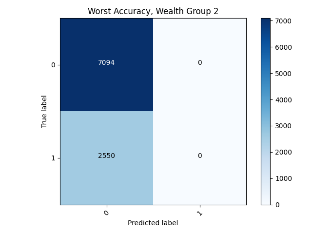
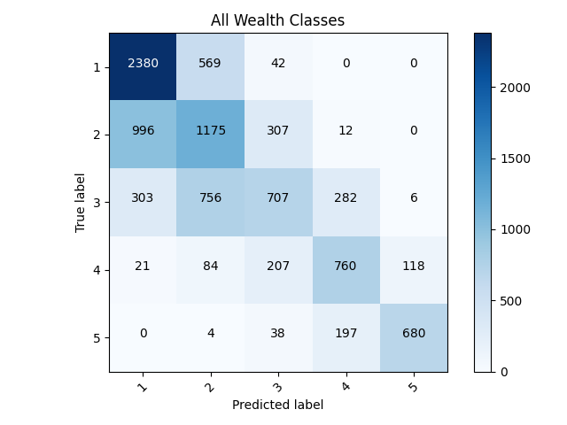

# Project 3

## Binary Target Model

### Best (Highest Accuracy)

• Wealth Group 5, the highest wealth group, had the best binary model, with a final accuracy of a whopping 96.2%. Due to the close proximity between the test accuracy and training accuracy, I didn't see any problems with overfitting. I continued using the same features, ultimately dropping `['hhid','pnmbr','weights', 'unit']` from the data and changing gender into a categorical variable. 

### Confusion Matrix and Analysis

### Worst (Lowest Accuracy)

• Wealth Group 2,

### Confusion Matrix and Analysis

 
## Categorical Target model

### Attempting improvements 