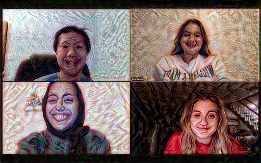

[The Script](meangirlsscript.md)

**the four of us, laughing during rehearsal**

### 1) How did you modify the data and python script in order to generate comprehensible text?

The primary challenge of the project was importing the data itself. First, we had to search the internet for a full-length script that could be usable for our model. Our efforts resulted in a .txt file that still needed to be cleaned up. Using the shakespeare.txt as reference, we went through the entire script to ensure that the stage directions were erased and that the characters’ names were in the line above the dialogue, as it corresponded to the shakespeare data. This process was long, as it was all done by-hand. However, once the data was cleaned, the major obstacle was behind us. The next challenge was running enough EPOCHS in order to achieve an understandable script. After a failed 30 EPOCHS that resulted in gibberish, we raised our EPOCH levels to 150,300,and 500. At these levels, we were able to get a coherent script.  Up to 300 epochs, we were still getting many non-English gibberish words.  Only at 500 epochs were we able to get a mostly comprehensible script, though still with a few gibberish words.
### 2) Did your output seem to generate text that was relying more on the entire corpus of your screen play (i.e. more associated with long term memory) or was it also able to incorporate some more immediate sequential associations (i.e. more associated with short term memory)?

Our model was able to do both; there were some sections of our output that were sequential in the movie and actually seemed like proper dialogue, but much of the script was all over the place in terms of wording and cognisance.

### 3) Did you make any changes to the model itself?

The model itself required little tweaking; there was no major difference in code between the original, the shakespeare model, and our meangirls model.

### 4) Were there any unexpected or surprising phrases or statements that were generated by your RNN?

The model was able to pick out some of the niche Mean Girls movie-specific terminology and categorize them as real words, as show in their reappearance in our new script: “Mathletes” is a good example, as it is a term from the original film that is otherwise not commonplace in daily vernacular. Also, the word “plastic” appears several times.  