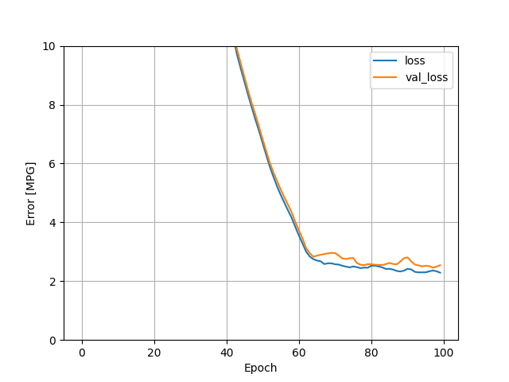
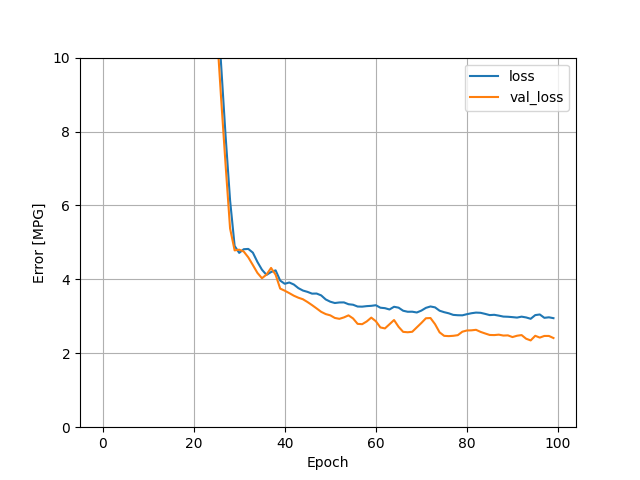
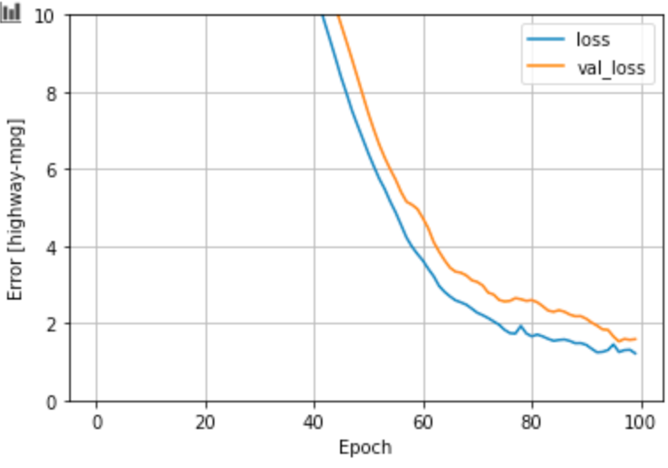

Specify and train both a multi-class linear regression and a multi-class DNN regression. 

We used the following variables in our regression:

1)highway-mpg

2)num-of-cylinders

3)engine-size

4)horsepower

5)curb-weight

Then, we produced a multi-class linear regression and a multi-class DNN regression.

The multi-class linear regression:

This results in both a loss and val_loss above 2.

The DNN-regression:

This results in both a loss and val_loss above 2 as well.

Which of the two models produces a better loss metric?

Based on our plot, it appears that the DNN produces a better loss metric; the slope of the linear model was greater than the slope of the DNN model.

##The Best Model
The following datapoints were added to make a more successful model

[‘highway-mpg’, ‘city-mpg’, ‘num-of-cylinders’, ‘engine-size’, ‘horsepower’, ‘curb-weight’, 'price']

The resulting loss hovered around 1.3; this model is better than the previous one, however, we assume some multicollinearity between highway-mpg and city-mpg, as data from those variables are similar. 

