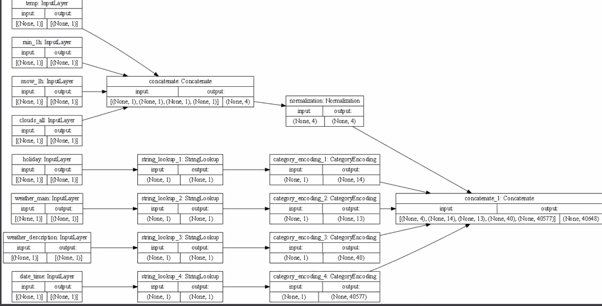

## Metro Interstate Traffic Volume Data Set
`plot_model()`

### plot description

• our data is from the iris dataset, which contains 120 flowers split into three classifications of iris: versicolor, virginica, and setosa. In the dataset, there are four features: sepal length, sepal width, petal length, and petal width. 

### What does each box in the illustration represent?

•

### Are there different paths towards the final concatenation step?

•

### What is occurring at each step and why is it necessary to execute before fitting your model?

•

### Describe the model output

### What is the target for the dataset? How would you assess the accuracy of each model?

•

### Are you using a different metric for each one? Why is this so? What is each one measuring?

•

##Iris Dataset
`plot_model()`

### plot description

### What does each box in the illustration represent?

•

### Are there different paths towards the final concatenation step?

•

### What is occurring at each step and why is it necessary to execute before fitting your model?

•

### Describe the model output

### What is the target for the dataset? How would you assess the accuracy of each model?

•

### Are you using a different metric for each one? Why is this so? What is each one measuring?

•

