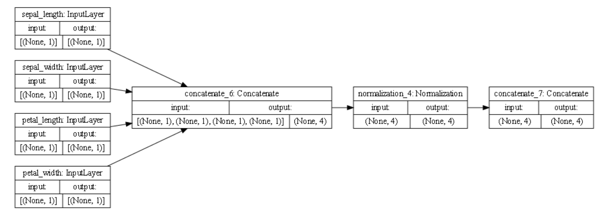

## Metro Interstate Traffic Volume Data Set

`plot_model()`

### plot description

• the first layer of our plot_model contains all the features from the dataframe. Then, there seems to be two resulting paths based on categorical or numeric data; one in which the numeric values are concatenated together and the other takes the input as strings, converts them to numerical values, and concatenates them together.  

### trained model

•weirdly enough, the resulting loss was negative, by a lot. Even after removing various features, the model still resulted in a strongly negative loss value. I am unsure with these results are due to my own computational error or from the model itself

## Iris Dataset
`plot_model()`

### plot description

• for the iris dataset, all the features were numeric, including the target. The features of this plot_model, as opposed to our metro plot, go through the same path (because they all are numeric). Additionally, all the features go through normalization after concatenation, which is uses to rescale the data.

### trained model

• the loss for the model was so small that it registered as zero after running 10 epochs. It seems like the differences that resulted in the loss are insignificant, but that is implausible. For the future, I would try to recreate a more efficient model for better and more accurate results. 

