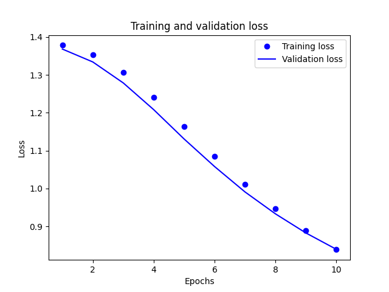
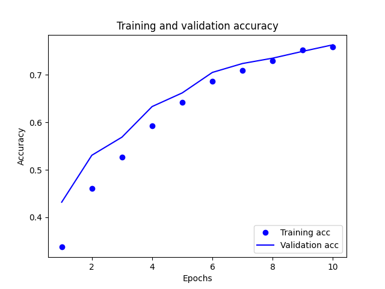

Question 1: “Provide plots that describe the training and validation loss and accuracy. Interpret the plots. How is this model performing?”

Model Performance:

Question 2: “Export the model and print the accuracy produced using the test data. Does the test data accuracy serve to validate your model?”

Question 3: “Produce three examples that are relevant to the multi-class classification model and predicting the language relevant to the stack overflow question. Produce the array generated by each of your three examples. Were these predictions accurate?”

Question 4: “Compare your multi-class model with your binary class model that predicted sentiment as either positive or negative in response to various movie reviews. What is the most significant difference between the two different types of models? Compare the two models and estimate which demonstrated better performance? Substantiate your response.”

