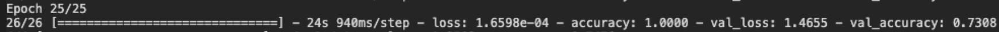
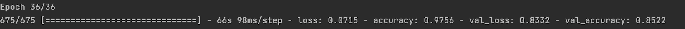
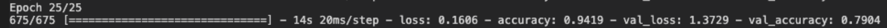

For class, we prepared code for the flowers dataset through tensorflow; we manipulated the code so that it would work with both the beans dataset and the EUROsat dataset; there were many complications. First, there was trouble importing the data. Then, we had to make sure we were configuring the data before we ran the model.fit, or else we would get a dimension error. Overall, the bulk of the trouble was trying to run all the epochs; some would run for hours and hours, so I had to resort in decreasing the amount of epochs ran. 

#Beans
Base Model:

After training the model, I reached an accuracy of .97 on the training data and a validation accuracy of 0.58. The validation loss is best at the beginning and gets worse after each epoch. The high accuracy of the training set suggests that the model became quickly overfit.

Augmented Model:
After running the base model, we applied augmentation. The data got more accurate, with a validation accuracy of 0.74, and an overall model accuracy of 1.0, which was arrived at fairly quickly. The loss function, however increased, with the accuracy leveling off after a few epochs. The augmentation definitely improved the accuracy of the validation dataset. 

#EuroSAT

Base Model:
After training the model, I reached an accuracy of .9756 on the training data and a validation accuracy of 0.8522. The validation accuracy increased steadily for the first few epochs, then leveled off. Though there was some degree of overfitting, the results remain positive.   

Augmented Model: The augmentation method did not improve the model much; it made the validation loss rise faster after a few epochs and decreased the top accuracy.  

•collaborated with Liz, Huatao, and Lydia