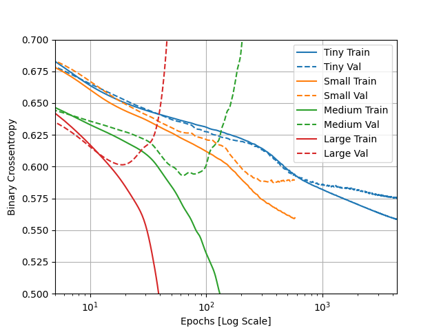
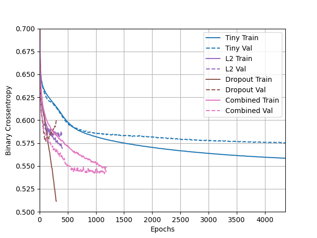

1) Describe the dataset. What type of variable is the target? How many features are being used? How many observations are in the training dataset? How many are used in the validation set? 
   
•The Higgs Dataset is a massive dataset with billions of entry data. The dataset used is a significantly smaller subset of the original dataset; there are 11,000,000 examples, each of which has 28  features.

•There are 10,000 observations in the training dataset, and 1,000 samples are used for validation. The target is a continuous variable. 

2) How did each of the four models perform (tiny, small, medium and large)? Which of the four models performed the best? Which ones performed the worst? Why in your estimation did certain models perform better? Produce a plot that illustrates and compares all four models.

•Out of our four models, the large model was the most overfit. The tiny model fares well, with little issue with overfitting. The small model runs almost parallel to the tiny model, except the slope increases and ends up being slightly overfit. Comparatively, both the medium and large models are incredibly overfit; their training and validation graphs go in opposite directions. The smallers models performed better and the larger models better possibly due to the increasing complexity.

3) Apply regularization, then add a drop out layer and finally combine both regularization with a dropout layer. Produce a plot that illustrates and compares all four models. Why in your estimation did certain models perform better?

•After regularization, it looks like all the models performed well except the dropout model. Looking at the graph, it seems that the combined model fared the best.

4) What is an overfit model? Why is it important to address it? What are four different ways we have addressed an overfit model thus far?

•

The four different ways we have addressed an overfit model are:
1) 
2)
3)
4)