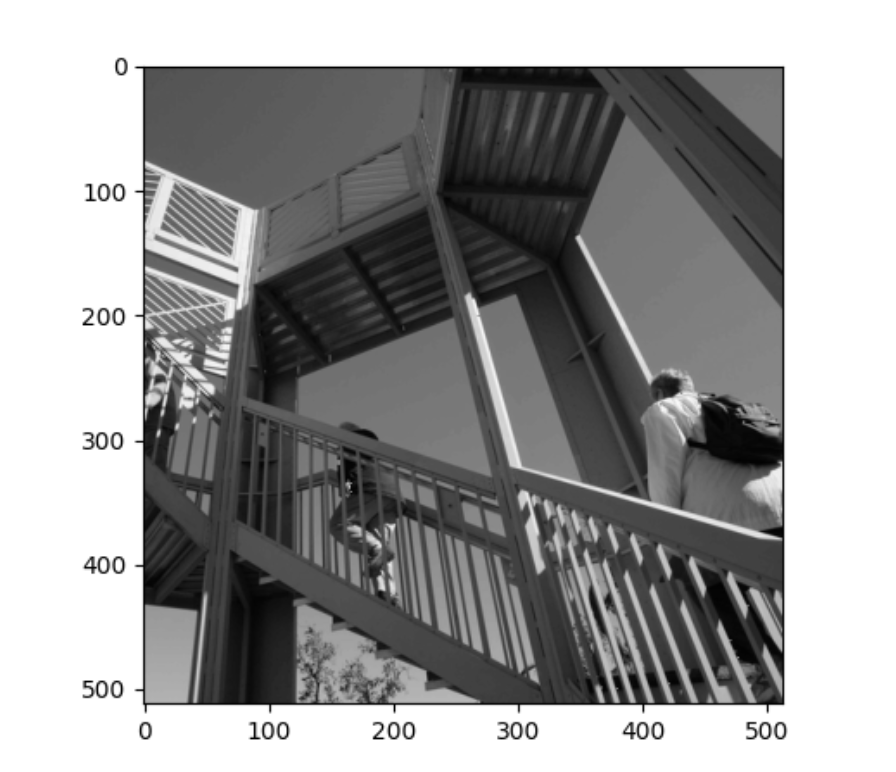
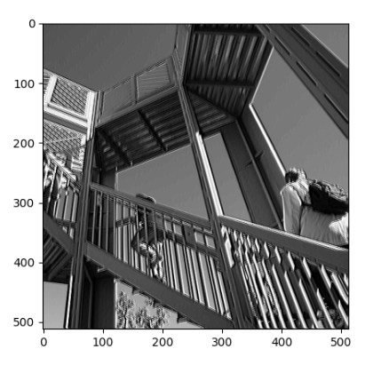
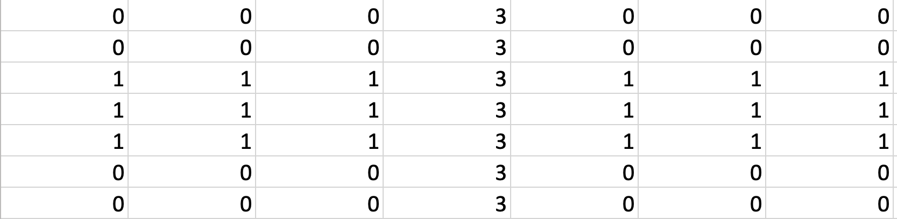

#Part 1: Higgs Dataset

1) Describe the dataset. What type of variable is the target? How many features are being used? How many observations are in the training dataset? How many are used in the validation set? 
   
•The Higgs Dataset is a massive dataset with billions of entry data. The dataset used is a significantly smaller subset of the original dataset; there are 11,000,000 examples, each of which has 28  features.

•There are 10,000 observations in the training dataset, and 1,000 samples are used for validation. The target is a continuous variable. 

2) How did each of the four models perform (tiny, small, medium and large)? Which of the four models performed the best? Which ones performed the worst? Why in your estimation did certain models perform better? Produce a plot that illustrates and compares all four models.

•Out of our four models, the large model was the most overfit. The tiny model fares well, with little issue with overfitting. The small model runs almost parallel to the tiny model, except the slope increases and ends up being slightly overfit. Comparatively, both the medium and large models are incredibly overfit; their training and validation graphs go in opposite directions. The smallers models performed better and the larger models better possibly due to the increasing complexity.

3) Apply regularization, then add a drop out layer and finally combine both regularization with a dropout layer. Produce a plot that illustrates and compares all four models. Why in your estimation did certain models perform better?

•After regularization, it looks like all the models performed well except the dropout model. Looking at the graph, it seems that the combined model fared the best. This is probably due to the combination of L2 regularization, which keeps the model from being too complex, and dropout, which drops features as the model is training.  

4) What is an overfit model? Why is it important to address it? What are four different ways we have addressed an overfit model thus far?

• An overfit model is a model that trains too closely to a set of data points. It is important to address such problems because overfitting reduces future applicability and possibly results in a useless model. 

The four different ways we have addressed an overfit model are:
1) L1 regularization
2) L2 regularization
3) dropout model
4) combination (dropout and L2 regularization)

#Part  2: Convolutions
##Plots:
How did each filter transform each image?

###Original Picture:

###Filter 1

•the filter I applied to this picture darkened the image immensely; it did a poor job highlighting the lines that would be useful for training. 

###Filter 2

•this filter, when applied, changed the picture very little. The filter visibly enhanced the vertical lines, resulting in a better image for training the model.

###Filter 3

•this filter, similar to the first filter, darkened the image; it seems that comparatively, this image did a better job at highlighting the important portions for training the data.

###What are you functionally accomplishing as you apply the filter to your original array?

•when each filter is applied to an image, the pixels are scanned and the values of each pixel are multiplied by the weights, which ends up transforming the picture.

###Why is the application of a convolving filter to an image useful for computer vision?

•convolution is useful because, when the image is transformed, the computer focuses on the key features of the image, which makes it easier for the model to classify each image correctly.

###The  2x2
2x2

###In effect what have you accomplished by applying this filter?

•the filter reduced the image into what is believed to be the most important features.

###Does there seem to be a logic (i.e. maximizing, averaging or minimizing values?) associated with the pooling filter provided in the example exercise (convolutions & pooling)?

•There is a maximizing logic behind pooling; the pooling filter takes the highest value in the pixel.

###Did the resulting image increase in size or decrease?

•The resulting image decreased in size from 500x500 to 250x250.

###Why would this method be useful?

•Because pooling reduces the complexity of a model to its most important features, the model can be trained easier and should improve accuracy; the information can be received through a faster and more efficient method.

##The Matrix
