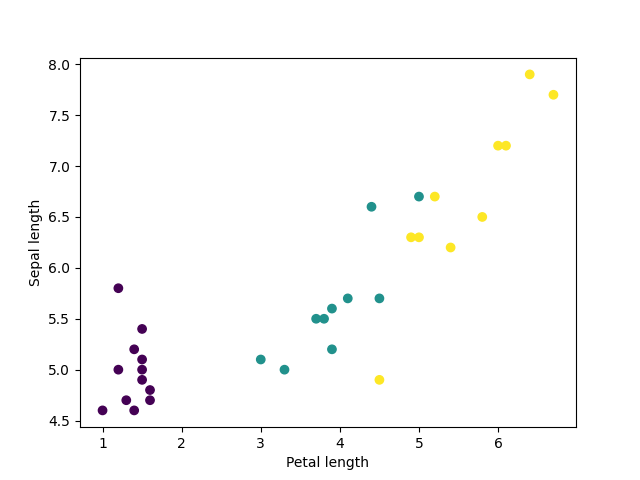
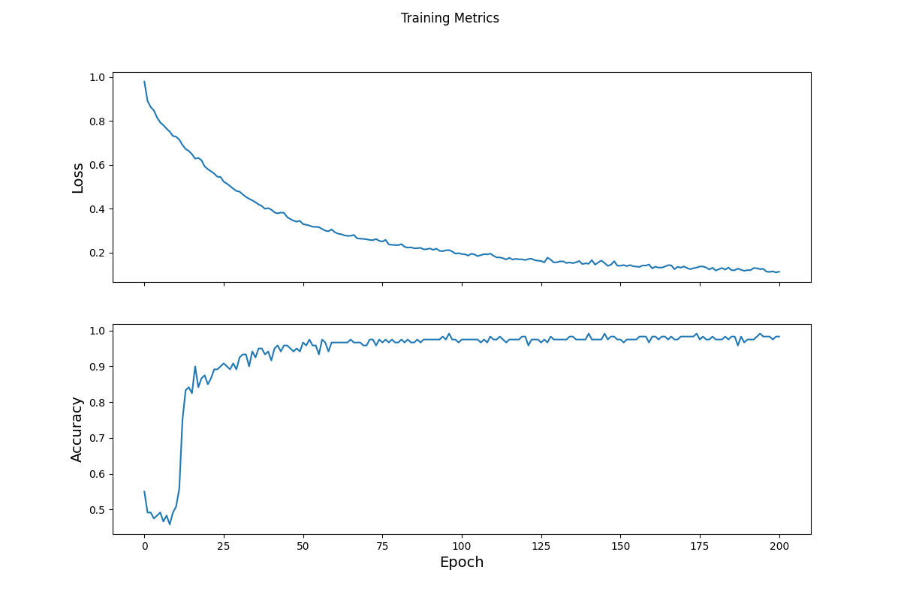

# Tuesday, 20 July

### the data used in the model

•our data is from the iris dataset, which contains 120 flowers split into three classifications of iris: versicolor, virginica, and setosa. In the dataset, there are four features: sepal length, sepal width, petal length, and petal width. 

### how you created the tf.dataset

• after importing our dataset, we had to transform our data into a format that we could use for future modeling, which was completed by using the tf.data.experimental.make_csv_dataset, using a batch size of 32. We examined the plot, which we can identify as clusters. 

### how you specified your model architecture, including the input shape, the layers and other functions
`model = tf.keras.Sequential([tf.keras.layers.Dense(10, activation=tf.nn.relu, input_shape=(4,)),  # input shape required 
tf.keras.layers.Dense(10, activation=tf.nn.relu),
tf.keras.layers.Dense(3)
])`

• the model was created using keras, which contained three different layers. The first layer had an input shape of four (the total number of features). The third and final layer had a density of three to correspond to the three possibly predicted flowers: versicolor, virginica, and setosa.

•Softmax and Argmax were both employed; the softmax function converts the logits to a probability for each class, whereas the argmax function gives the predicted class index.
### how you trained/optimized the model

•In order to train the model, we used Simple Categorical Crossentropy, which returned the average loss among the examples. Next, we defined the gradients, which would be used to optimize the model. For our optimizer, we used SGD, which implemented the stochastic gradient descent algorithm, which minimizes loss by computing the gradients of loss with respect to the model's parameters. Afterwards, we are able to set up the training loop and visualize our loss function.

### how you estimated loss including a plot that describes that change per epoch

•from our graph, the loss function is promising; it starts high, but it ended up quickly leveling out. The loss function is overall good, but possible further testing could improve it.

### how you evaluated the model with your test dataset

• to evaluate our model, we loaded our test dataset and recorded how accurate our model performed. In doing this, we are also checking for overfitness. The overall accuracy was 98.33%, which indicates that our model was accurate and had few to no overfitting issues.
### how you made some predictions, including three new ones of your own and their results

• finally, I used random values to predict if the model could accurate predict the class of flower by four features. 

Array of values:

•[6.1, 3.2, 1.8, 1.5,]

•[5.9, 2.5, 3.2, 2.5]

•[3.4, 2.5, 4.3, 2.1]

`Example 0 prediction: Iris setosa (88.5%)`

`Example 1 prediction: Iris versicolor (80.3%)`

`Example 2 prediction: Iris virginica (99.8%)`

