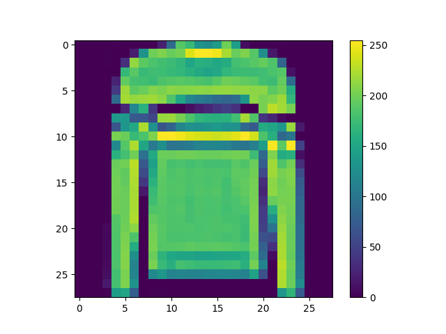
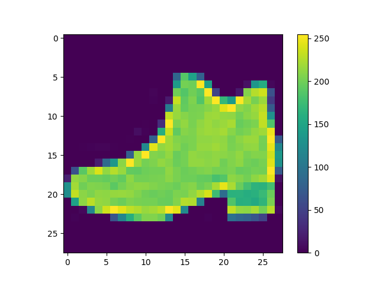
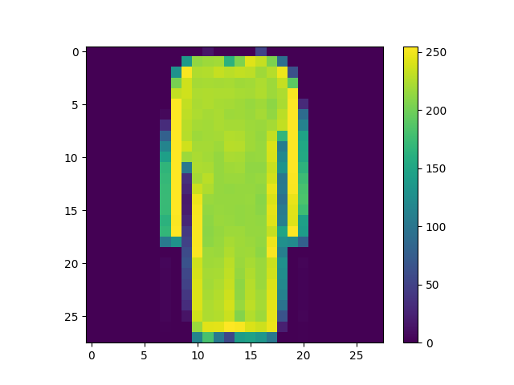
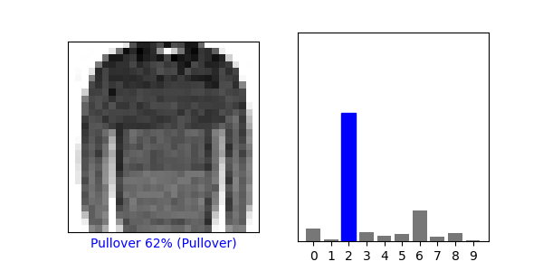
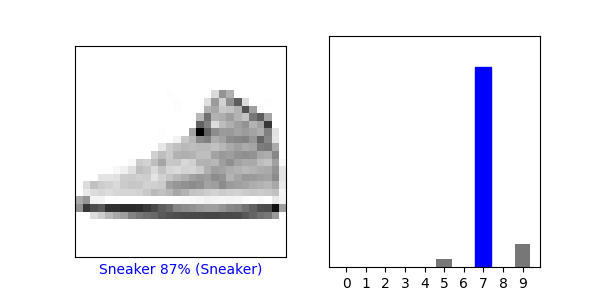
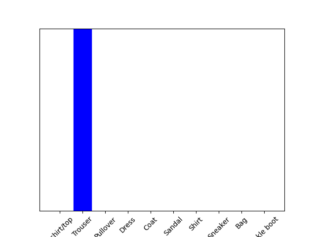
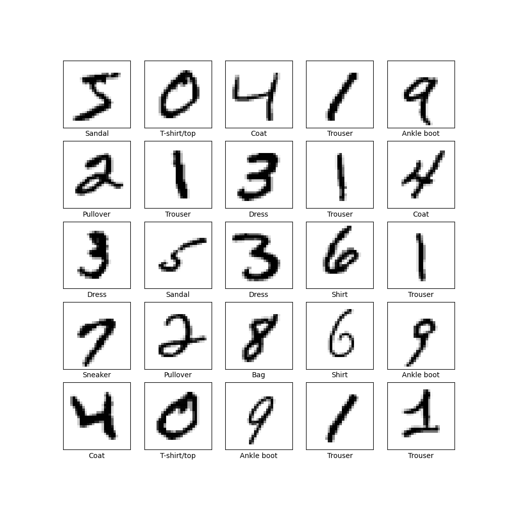
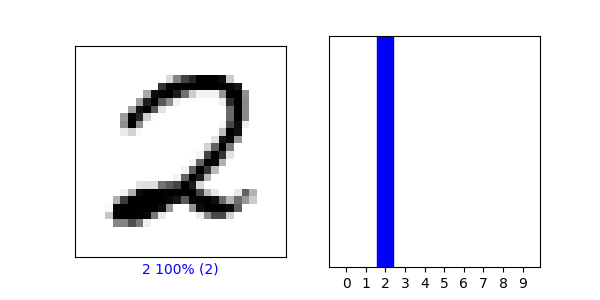
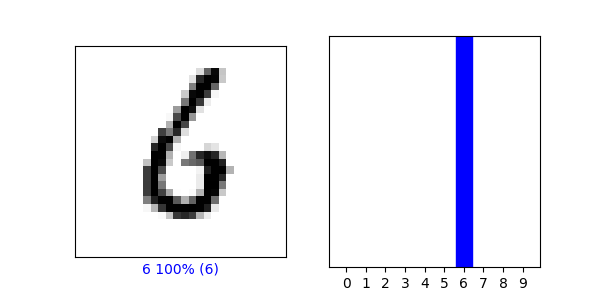

Responses to Wednesdays Prompt

1) Preprocess the data 

Index = 5 

Index = 15

Index = 25

Make Predictions:
Array of Predictions at index 5

Softmax: array([0.0000000e+00, 1.0000000e+00, 2.6920213e-36, 6.2433840e-33,
1.9604979e-08, 4.2933546e-17, 6.1267055e-21, 1.4999898e-19,
4.9671605e-22, 4.1210581e-17], dtype=float32)

The np.argmax() and Softmax were classified as 1, meaning the model predicted accurately. The softmax function made predictions with the target , which outputed an array. Moreover, the argmax function was used to check for the highest softmax prediction.

Verify Predictions:

Index = 20

Index = 45

Using the trained model:

On index = 3

The array of predicitions for the test image: [[2.0600728e-09 9.9999988e-01 3.6239403e-10 7.4216111e-08 1.4957640e-08
1.2740857e-16 4.9858895e-10 5.1614350e-18 1.1119836e-12 2.2391287e-16]]

The model correctly identified that the image was Trouser.

Part 2:

After fitting the data, the accuracy was
0.9980 on the training data and 0.9775 on the testing data.

Index = 35

Index = 50

Accuracies:

Comparing our accuracies between the FashionMNIST and MNIST, it appears that MNIST handwritten model performed better than the FashionMNIST model. I would assume that this occurs because the images in the MNIST model are less complex/have less pixels, and share a greater amount of pattern, thus being able to predict more accurately.
