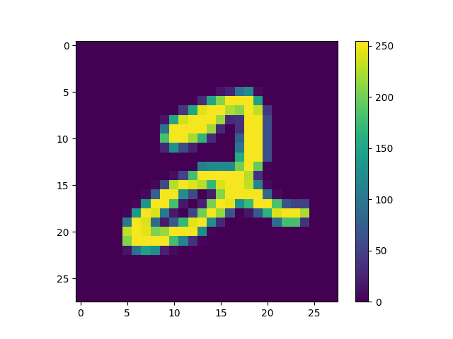
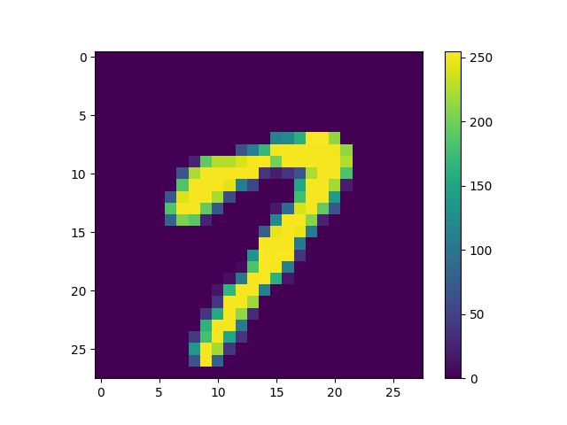
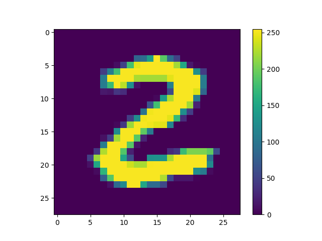
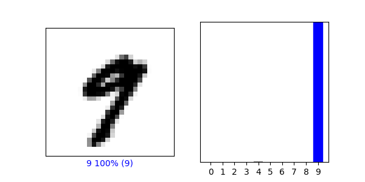
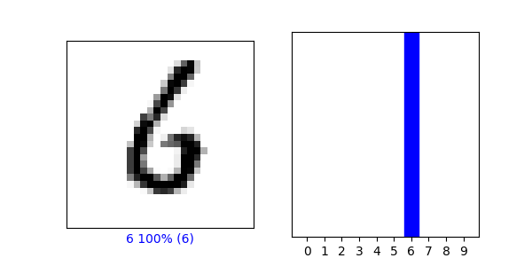

Responses to Wednesdays Prompt

1) Preprocess the data 

Index = 5 

Index = 15

Index = 25

Make Predictions:
Array of Predictions

Softmax: array([0.0000000e+00, 1.0000000e+00, 2.6920213e-36, 6.2433840e-33,
1.9604979e-08, 4.2933546e-17, 6.1267055e-21, 1.4999898e-19,
4.9671605e-22, 4.1210581e-17], dtype=float32)

The np.argmax() and Softmax were classified as 1, meaning the model predicted accurately. The softmax function made predictions with the target , which outputed an array. Moreover, the argmax function was used to check for the highest softmax prediction.

Verify Predictions:

Index = 20

Index = 50

Using the trained model:

On index = 9
[[1.4295059e-29 5.6032602e-15 8.5530046e-14 6.6799873e-12 1.3503964e-03
1.3568001e-13 2.0982960e-29 4.8858096e-06 1.1485544e-11 9.9864477e-01]]

Part 2:

After training the data, the accuracy was
0.9980 on the training data and 0.9775 on the testing data.

Index = 35

Index = 50

Accuracies:

Comparing our accuracies between the FashionMNIST and MNIST, it appears that MNIST handwritten model performed better than the FashionMNIST model. I would assume that this occurs because the images in the MNIST model are less complex/have less pixels, and share a greater amount of pattern, thus being able to predict more accurately.
