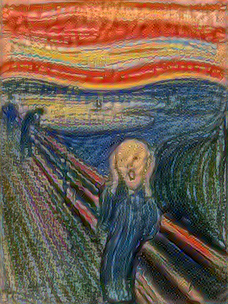

### Picture 1 

### Picture 2 

## The Franken-Picture(s)

### Why'd I choose these photos??

• The first picture, the octopus emoji, is a symbol of endearment between my mother and me. My mother was the one who encouraged me to take on Applied Machine Learning- and I am very grateful that she did. _The Scream_, a popular Expressionist painting, perfectly captures my emotions of the summer and the upcoming school year. 

• It's funny; the famous _Scream_ is already hard to make out, but the newly transformed is an enigma in itself (dare I say it is better?). The original image conveys lively emotion, a nod to my pre-data science life, where I was certainly less knowledgeable of tensorflow. 

### Steps Needed
•Define content and style representations

For the model, we had to use the intermediate layer of the model, using the VGG19 network architecture, a pretrained image classifcation network. 

•Extracting style and content

The style was calculated using a Gram matrix, then the model is built that returns the style and content tensors.

•Implementing the style transfer algorithm

After getting the style and content extractor, we use the style transfer algorithm, which uses the MSE for the image's output relative to each target, then takes the weighted sum of these losses. 

•Apply regularization term on the high frequency components

Finally, we use regularization.in order to address the production of high frequency artifacts that are produced by this basic implementation, which are decreased by using an explicit regularization term on the high frequency components of the image

### Future as a Data Scientist

In the most abstract sense, these two pictures can be related to my future as a data scientist. For mixture of octopus emoji and _The Scream_, the possible success achieved may be attributed to a great support structure that I find through family, friends, and faculty, all while being terrifed of the future and the stress that accompanies the coding life. 