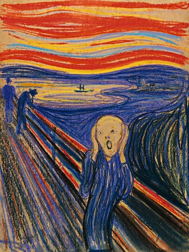

### Picture 1 

### Picture 2 

## The Franken-Picture(s)

### Why'd I choose these photos??

• The first picture, the octopus emoji, is a symbol of endearment between my mother and me. _The Scream_, a popular Expressionist painting, perfectly captures my emotions of the summer and the upcoming school year. 

• It's funny; the famous _Scream_ is already hard to make out, but the newly transformed is an enigma in itself (dare I say it is better?). The original image conveys lively emotion, a nod to my pre-data science life, where I was certainly less knowledgeable of tensorflow. 

